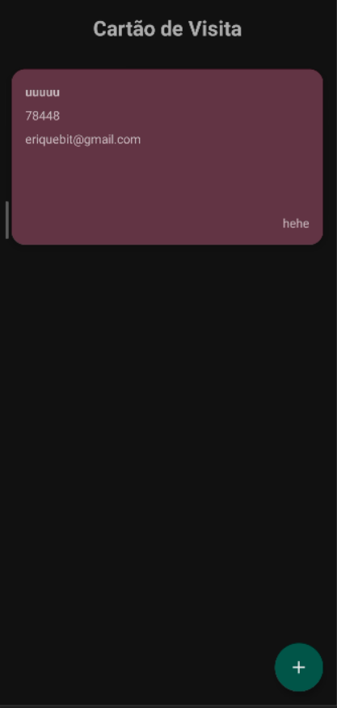

# Cartao de Visitas

<div align="center">

<h1>A aplicação executa a função de criar cartões de visitas com os dados de preferência do usuário</h1>

<p>O APP utiliza da biblioteca do "Room" para persistir os seus dados. Ao executar encontraremos sua tela inicial que mostra todos os seus cartões já salvos</p>

<div align="left">

```
dependencies {
    implementation "androidx.room:room-ktx:2.4.3"
    implementation "androidx.room:room-runtime:2.4.3"
    kapt "androidx.room:room-compiler:2.4.3"
    }
```

</div>



<p>Tela de entrada de dados para a criação do cartão: </p>


<p>Mais para frente será feita uma mudança para selecionar a cor do cartão sem precisar digitar o código da cor </p>

#

<p>Após a confirmação dos dados o cartão e criado e o usuário retorna a tela inicial com as listas de cartões</p>


<p>Cada cartão é clicável e dá inicio ao processo de criação do cartão apartir do mapeamento de pixels, após a imagem do cartão ser criada é iniciado o processo de compartilhamento</p>

  

  
</div>
